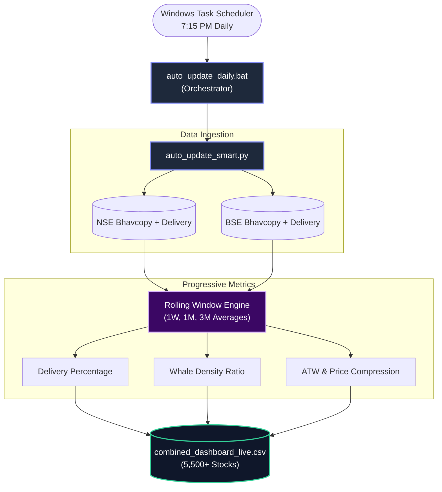
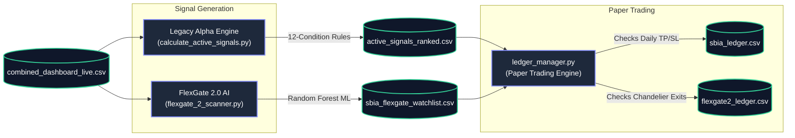
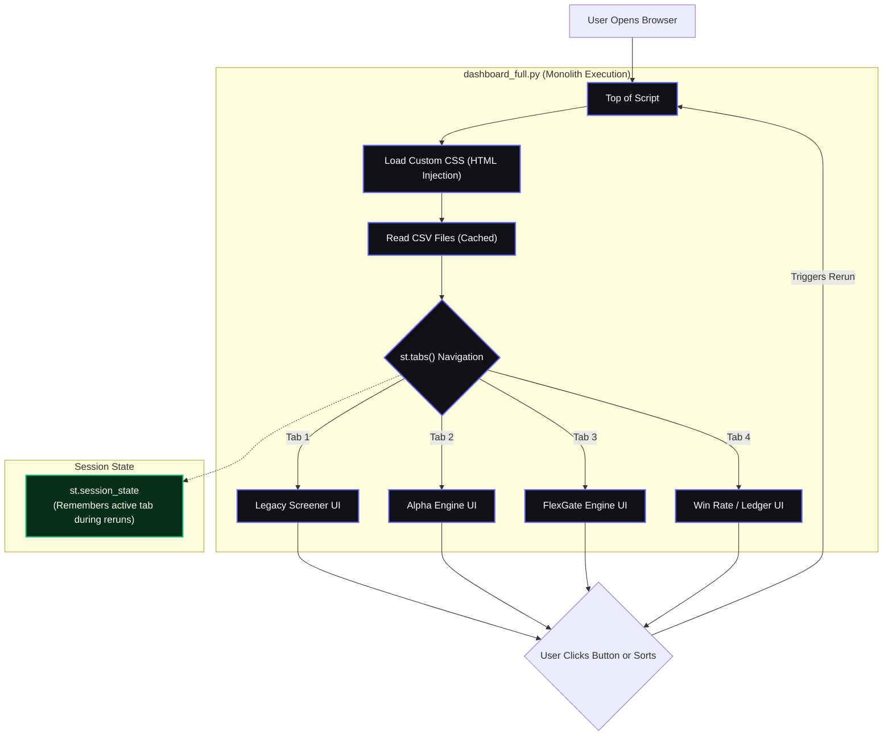
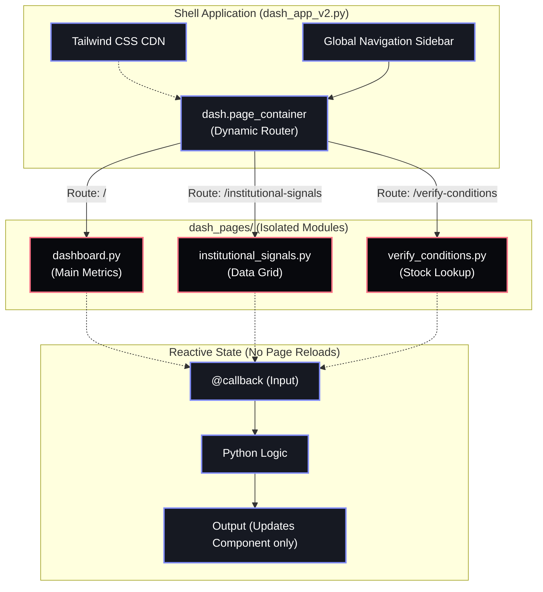

# Project Architecture: SBIA Terminal (Trading Dashboard)

**Document Version:** 1.1 (August 2026)
**Project Intent:** To build a proprietary, institutional-grade Indian market screener that tracks "smart money" footprints in the NSE and BSE. The system detects anomalous institutional accumulation (high delivery volumes, price compression, whale density) before retail participants notice, filtering out noise using multi-timeframe progressive metrics and Machine Learning, and displaying actionable entry/exit signals for trend-following and swing trading.

---

## 1. The Core Data Pipeline (The Engine)

The pipeline is the foundation. It runs entirely independent of any user interface.

### 1.1 Automated Data Ingestion
*   **Trigger:** Windows Task Scheduler runs `auto_update_daily.bat`.
*   **Orchestrator:** `auto_update_smart.py` (v4).
*   **Execution:** Downloads daily Bhavcopy and Delivery data, handles missing exchange uploads with retries.

### 1.2 Progressive Metrics Calculation
The raw data is merged and passed through a rolling window engine to calculate proprietary "Smart Money" metrics (Whale Density, ATW, Delivery Turnover). Output is compiled into `combined_dashboard_live.csv`.

---

## 2. The Intelligence Layer & Simulation

*   **Legacy Alpha Engine:** Uses a strict "12-Condition" algorithmic filter (ProgressiveSpiker).
*   **FlexGate 2.0 Engine:** Uses a Random Forest ML model (`flexgate2_model.joblib`) to evaluate `Whale_Density` and `STABILITY_SCORE`, generating 14-day ATR Chandelier Exits via Yahoo Finance.
*   **Ledger Manager:** Dynamically checks daily highs/lows against targets/stops. If hit, closes trade and logs P&L.

---

## 3. Legacy UI Architecture: Streamlit

The original frontend was built as a massive, single-file monolith. Because Streamlit is procedurally executed, every interaction forces the entire script to run from top to bottom.

### 3.1 Structural Limitations
*   **Execution Model:** Procedural. If you click a sort button on Tab 3, the entire file re-runs from Line 1.
*   **Styling:** Because Streamlit blocks custom styling, we use massive `unsafe_allow_html=True` blocks to brute-force CSS into the DOM.
*   **Data Grids:** Relies on `st.dataframe` which is rigid and hard to style dynamically.

---

## 4. Next-Gen UI Architecture: Plotly Dash

The Phase 2 frontend designed for public SaaS deployment, high performance, and premium aesthetics.

### 4.1 Reactive Routing
Unlike Streamlit, Dash separates the shell from the pages. `dash_app_v2.py` holds the persistent sidebar, and `dash.page_container` swaps out the middle content without ever reloading the browser.

### 4.2 Callback Engine
When a user types into the search box in `verify_conditions.py`, a `@callback` fires. It sends the input to Python, runs the logic, and returns *only* the new layout for that specific box. The rest of the page remains untouched. This is exponentially faster than Streamlit.

### 4.3 Styling System
*   **Tailwind:** Utility classes (`p-4 flex bg-primary`) generate CSS instantly.
*   **Glassmorphism Engine:** Centralized in `assets/style.css` using `backdrop-filter: blur()`.
*   **Typography:** Google Fonts (Inter + JetBrains Mono).
